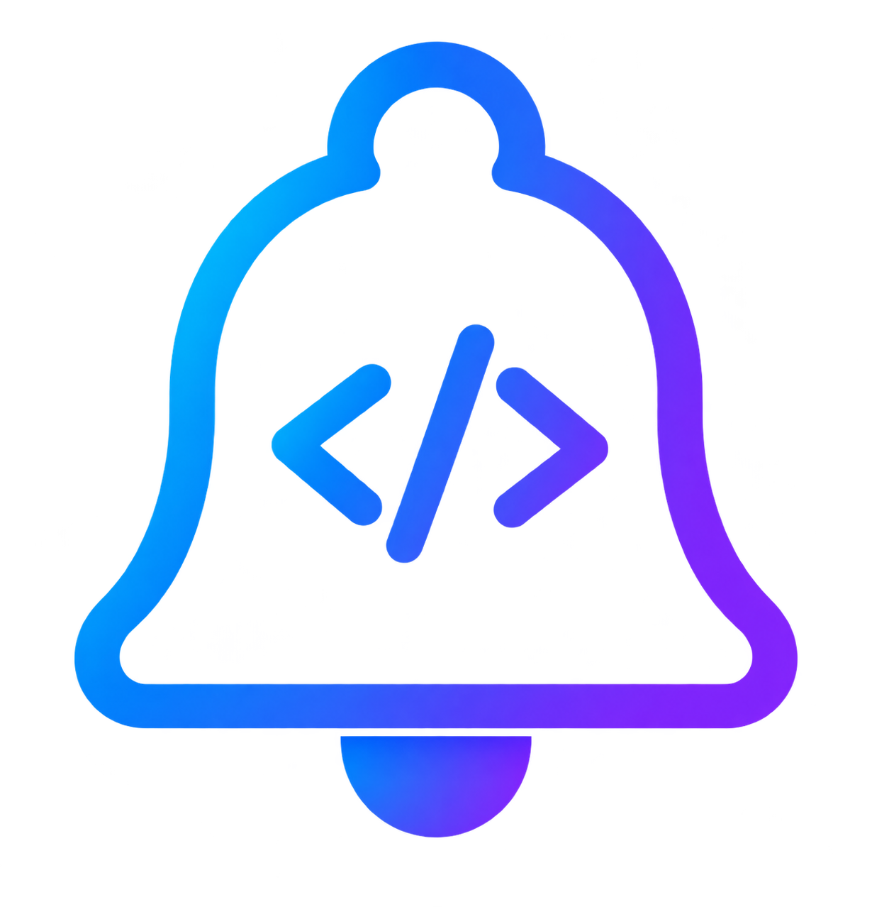

<div align="center">
  
  <h1>CodexNotify</h1>
  <p>Send Codex completion, user-input, and permission alerts to your iPhone and Apple Watch through Bark.</p>
  <p>
    <a href="README.md">简体中文</a> ·
    <a href="README_EN.md">English</a> ·
    <a href="https://github.com/Xiiiing/CodexNotify/releases/latest">Download</a>
  </p>
</div>

## Overview

CodexNotify is a lightweight notification companion for Windows, macOS, and Linux. It listens for Codex `Stop` and `PermissionRequest` Hooks and captures `request_user_input` through `PreToolUse`, sending a Bark notification when a task finishes, waits for input, or requests permission.

- The desktop app uses Tauri 2, React, and TypeScript for settings, history, diagnostics, and Hook management.
- Rust handles the Hook, HTTP requests, AES encryption, SQLite queue, and sensitive-data redaction.
- Headless Linux receives a static CLI with no GTK, WebKitGTK, GIO, or display-server dependency.
- The independent Hook can queue and send notifications while the desktop app is closed.
- Bark and AES keys are never written to JSON, SQLite, or logs.

## Downloads

Every version has one GitHub Release page containing exactly four application products:

| Environment      | File                                        | Architecture          | Usage                                          |
| ---------------- | ------------------------------------------- | --------------------- | ---------------------------------------------- |
| Windows 10/11    | `CodexNotify-Windows-x64.exe`               | x86_64                | Portable; double-click to run                  |
| macOS            | `CodexNotify-macOS-Universal.dmg`           | Intel + Apple Silicon | Open the DMG and drag the app to Applications  |
| Linux desktop    | `CodexNotify-Linux-Desktop-x86_64.AppImage` | x86_64                | Make executable and run directly               |
| Linux server/CLI | `codex-notify-Linux-CLI-x86_64`             | x86_64                | Static single-file CLI, Hook, and retry daemon |

Download the latest version from [Releases](https://github.com/Xiiiing/CodexNotify/releases/latest).

> The Windows and macOS builds do not currently have commercial code-signing certificates. The operating system may request a one-time confirmation. Only download builds from this repository's Release page.

## Desktop quick start

### 1. Launch

Run the downloaded `.exe` on Windows. On macOS, open the `.dmg` and drag CodexNotify into Applications. On Linux Desktop:

```bash
chmod +x CodexNotify-Linux-Desktop-x86_64.AppImage
./CodexNotify-Linux-Desktop-x86_64.AppImage
```

The Linux desktop edition needs a working WebKitGTK desktop session. Use the Linux CLI edition on servers without a graphical environment.

On Windows, save the EXE in a stable folder such as `Downloads` or `Apps` before launching it. Do not choose **Open** directly from the Edge download flyout. Browser `MicrosoftEdgeDownloads` temporary folders are rejected for portable storage.

### 2. Choose a data location

On first launch, CodexNotify asks where to store non-secret application data:

| Mode           | Description                                                                                  |
| -------------- | -------------------------------------------------------------------------------------------- |
| System default | Recommended. Uses the operating system's standard per-user config, data, and log directories |
| Beside the app | Creates `CodexNotifyData/config`, `data`, and `logs` beside the executable                   |
| Custom folder  | Stores settings, history, queue, logs, and the Hook under a selected directory               |

For portable and custom locations, a small `storage.json` locator remains in the system configuration directory so the independent Hook can find the selected data while the desktop app is closed. It contains no Bark key, AES key, or notification body.

After downloading a new executable, a stored location is reused only when its `settings.json` still exists and is valid. If the old directory was removed or is incomplete, CodexNotify does not recreate it and shows the location chooser again. Credentials in the operating-system store remain available.

### 3. Connect Bark

Confirm the automatically detected source-device name, enter the Bark server and Device Key, then send a test notification. Titles use “device name · project name”; a subtitle appears only when the Hook directly supplies a session name. CodexNotify also supports Markdown, images, critical volume, badges, repeated sounds, copy text, archive controls, tap actions, stable IDs, remote update/delete, and AES-128/256-CBC encryption.

Desktop secrets are stored in the operating system credential store:

- Windows Credential Manager
- macOS Keychain
- Linux Secret Service, such as GNOME Keyring or KWallet

If Linux has no available Secret Service, CodexNotify reports that the credential store is unavailable. It never falls back to plaintext storage.

### 4. Install and trust the Hook

1. Open the System page in CodexNotify.
2. Select **Install / Repair**.
3. Return to Codex and enter `/hooks`.
4. Select `PreToolUse`, `PermissionRequest`, and `Stop`, then press `T` to trust each Hook.
5. Return to CodexNotify and select **Check trust**.

CodexNotify never writes trust approval on your behalf. Codex may request another review after a Hook definition changes.

Windows Hook commands use PowerShell invocation syntax and safely handle paths containing spaces. Verbatim `\\?\` custom paths written by an older build are simplified when loaded; select **Install / Repair** once to update the Hook command.

### 5. Complete removal

**System → Application removal → Remove application** removes CodexNotify's own Hooks, Bark/AES credentials, autostart entry, settings, SQLite history and queue, logs, standalone Hook, and the current application file. Third-party Hooks are preserved, and a safety backup of `hooks.json` remains under `~/.codex`.

## Headless Linux

The CLI product is a fully static x86_64 Linux executable with no desktop dependencies. Installation requires only one environment variable: `CODEX_NOTIFY_BARK_KEY`.

```bash
mkdir -p ~/.local/bin
curl -fL https://github.com/Xiiiing/CodexNotify/releases/latest/download/codex-notify-Linux-CLI-x86_64 \
  -o ~/.local/bin/codex-notify
chmod +x ~/.local/bin/codex-notify

export CODEX_NOTIFY_BARK_KEY='your Bark Device Key'
export PATH="$HOME/.local/bin:$PATH"
codex-notify init
codex-notify test
codex-notify hook install
codex-notify hook status
```

Next, enter `/hooks` in Codex and trust `PreToolUse`, `PermissionRequest`, and `Stop`. Launch Codex from the same terminal. Add the two `export` lines above to `~/.bashrc` or `~/.zshrc` to make them persistent. No custom data directory or resident daemon is required; later Hook events also process failed retries.

AES encryption, a custom data root, and a resident retry service remain optional advanced capabilities and are not needed for a normal Linux CLI deployment.

Common commands:

```bash
codex-notify status
codex-notify config show
codex-notify config set bark-server https://api.day.app
codex-notify events list 20
codex-notify events retry all
codex-notify events clear
codex-notify daemon
codex-notify daemon --once
codex-notify hook uninstall
```

`daemon` continuously handles due retries and can be supervised by systemd, Supervisor, or another process manager. `daemon --once` processes currently due work and exits. Without a daemon, future Hook events also process a small number of due notifications.

## Data, secrets, and migration

| Content                                              | Location                                                           |
| ---------------------------------------------------- | ------------------------------------------------------------------ |
| Regular settings                                     | `config/settings.json`                                             |
| Notification history, deduplication, and retry queue | `data/events.sqlite3`                                              |
| Independent Hook and health state                    | `data` directory                                                   |
| Runtime logs                                         | `logs` directory                                                   |
| Bark Device Key                                      | OS credential store; the CLI can also read an environment variable |
| Bark AES key                                         | OS credential store; the CLI can also read an environment variable |

Use **System → Data location → Change location** to migrate an installation. CodexNotify will:

1. Copy and validate settings, SQLite history and queue, logs, and the Hook;
2. Switch the shared locator only after validation succeeds;
3. Repair the installed Hook's absolute path;
4. Delete the old `config`, `data`, and `logs` contents;
5. Restart the app.

The destination must be empty. Credential-store entries are outside these directories and are neither moved nor deleted. Codex may require a new trust review after the Hook path changes.

Advanced deployments can set `CODEX_NOTIFY_DATA_DIR` to override the root of all non-secret data. This override has the highest priority and disables desktop location changes while active.

## How it works

```text
Codex
  └─ JSON/stdin → independent Rust Hook
                    ├─ classification, filtering, and redaction
                    ├─ SQLite deduplication, reliable queue, and retries
                    ├─ OS credential store / environment variables
                    └─ Bark HTTP(S) with optional AES

Desktop app
  └─ React UI → Tauri Rust backend
                    ├─ tray, single instance, and autostart
                    ├─ Hook install, repair, removal, and diagnostics
                    └─ background due-queue processing
```

The Hook always returns a successful protocol response to Codex. Delivery failures are written to the log and reliable queue and never interrupt Codex. `PermissionRequest` is notification-only and never allows or denies an operation.

## Features

- Automatically detected, editable device name and a fixed “device · project” title
- `Stop`, ordinary input-request, and permission-request alerts with optional Hook session subtitles
- Bark Markdown, image, volume, badge, sound, copy, archive, action, remote update, and deletion controls
- AES-128/256-CBC encrypted pushes
- All-project, include, exclude, and project-alias rules
- Chinese/English UI with system, light, and dark themes
- Quiet hours, message truncation, and sensitive-data redaction
- SQLite deduplication, offline queue, exponential backoff, retry, and history cleanup
- Hook install, repair, uninstall, trust inspection, and environment diagnostics
- Tray mode, single instance, login autostart, and low-frequency background work

## Development

Install the current stable Rust toolchain, Node.js 22+, npm, and the platform-specific [Tauri 2 prerequisites](https://v2.tauri.app/start/prerequisites/). Ubuntu/Debian desktop builds require:

```bash
sudo apt-get install libwebkit2gtk-4.1-dev libappindicator3-dev librsvg2-dev patchelf pkg-config
```

Run the desktop development build:

```bash
cd apps/desktop
npm ci
npm run tauri:dev
```

Run tests:

```bash
cargo fmt --all -- --check
cargo test -p codex-notify-core -p codex-notify-hook -p codex-notify-cli
cd apps/desktop
npm test
npm run build
```

Workspace layout:

- `crates/codex-notify-core`: shared settings, events, Bark, encryption, SQLite, credentials, and Hook configuration
- `apps/hook`: independent Hook embedded by desktop builds
- `apps/cli`: headless Linux CLI, Hook, and daemon
- `apps/desktop/src-tauri`: Tauri backend
- `apps/desktop/src`: React and TypeScript frontend

## Releases and license

Pushing a `v*` tag builds and verifies four platform products in one GitHub Release. Commercial Windows/macOS signing, installers, and automatic updates are not provided yet.

CodexNotify is available under the [MIT License](LICENSE).
